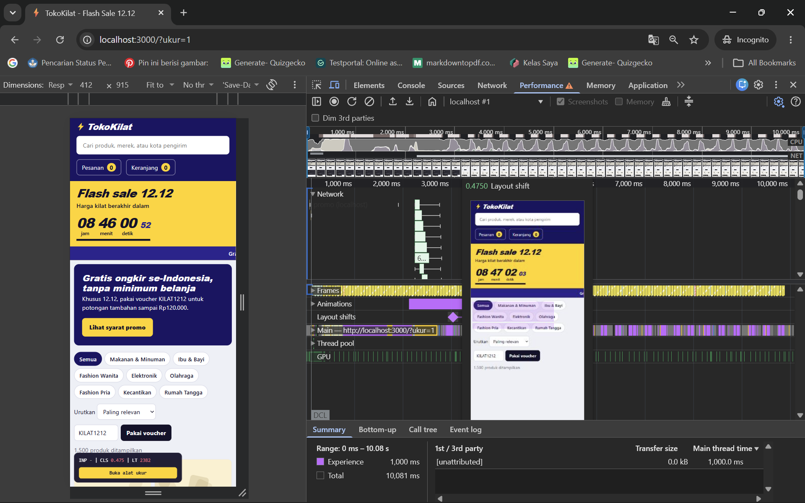
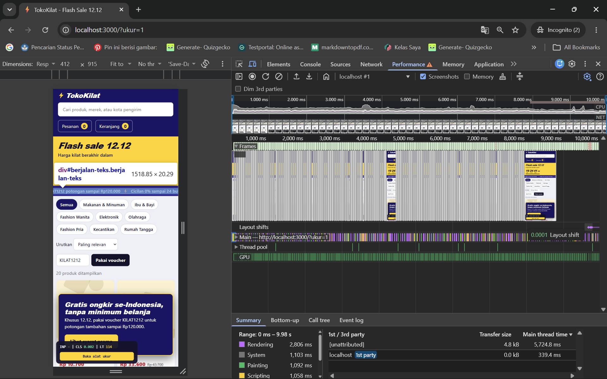
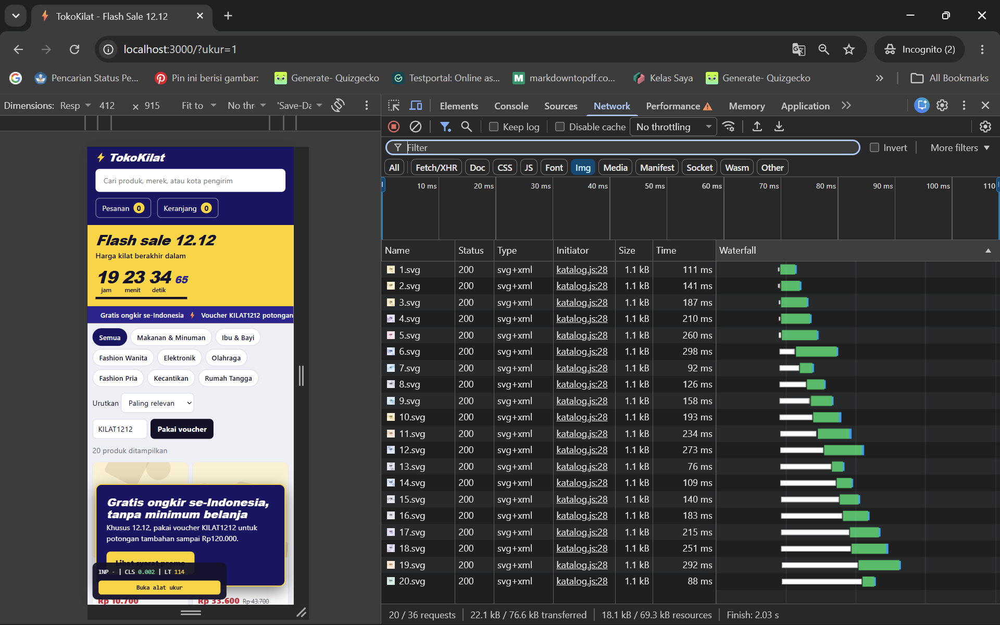
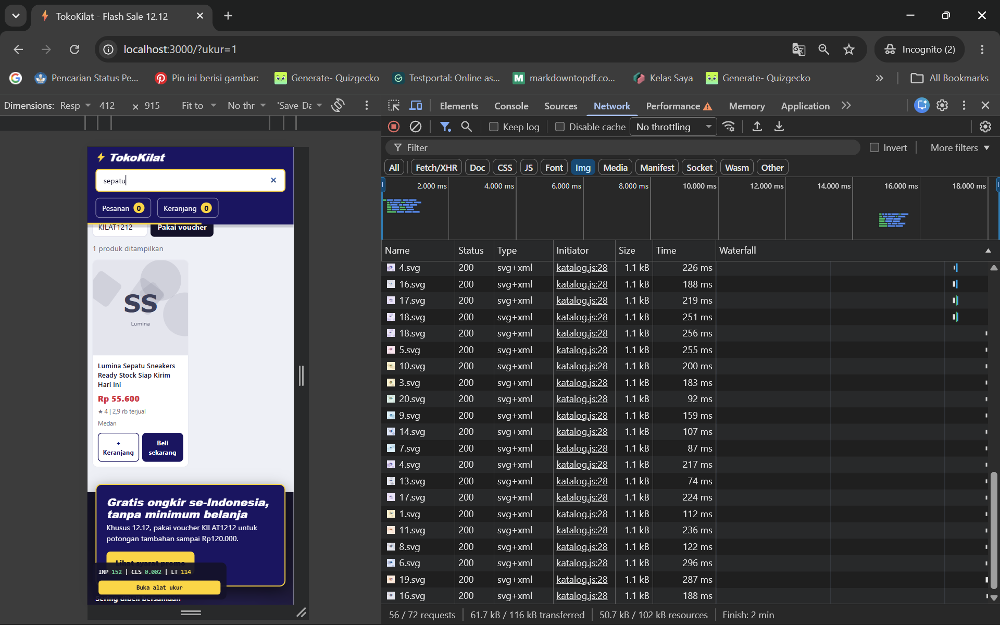

# Audit usulan perbaikan dari AI

Peran Anda di sini adalah **reviewer**. Minta sebuah AI (asisten chat atau coding agent) memperbaiki
minimal dua tiket, sebaiknya di branch terpisah. Uji usulannya dengan protokol pengukuran yang sama.
Temukan minimal **dua** usulan bermasalah. Usulan AI yang bagus juga boleh dicatat, tetapi tidak
menggantikan dua temuan wajib.

Alat AI yang dipakai: Google Antigravity Model 3.6 Flash Medium | Branch atau commit tempat usulan diterapkan: Afriza

---

## A-01: Mengubah Banner Promo Menjadi Modal FIxed Overlay/Menghapus Function samakanTinggiJudul

- **Tiket yang diminta diperbaiki:** TK-1078 (Skenario S0 - Layout Shift)
- **Prompt yang diberikan (ringkas):** Halaman meloncat ke bawah saat pemuatan awal dan nilai CLS 0,475. Perbaiki kode agar tidak terjadi layout shift.
- **Usulan AI (ringkas, sertakan potongan kode yang relevan):** AI mengira layout shift disebabkan oleh _layout thrashing_ pada fungsi `samakanTinggiJudul()` di `katalog.js`, atau menyarankan membuat banner promo berposisi `position: fixed` / `absolute` melayang di layar, berikut adalah potongan kodenya
  ```css
  .promo-banner {
    position: fixed;
    bottom: 20px;
    left: 20px;
    right: 20px;
    z-index: 9999;
  }
  ....
  ```
- **Jenis masalah pada usulan:** pilih satu atau lebih
  - [X] Salah diagnosis (memperbaiki hal yang bukan penyebab)
  - [ ] Tidak lengkap (gejala berkurang tetapi akar masalah masih ada)
  - [X] Menimbulkan regresi (metrik lain, fitur, aksesibilitas, atau memori memburuk)
  - [ ] Melanggar aturan main (menghapus fitur, mengubah berkas terlarang, dan sebagainya)
  - [X] Memperbaiki sesuatu yang tidak berpengaruh terukur
- **Bukti:**



Pada rekaman flame chart panel Performance, `samakanTinggiJudul()` hanya dieksekusi di awal (~20 ms) dan tidak menyumbang skor CLS. Pergeseran tata letak sebesar **0,475** terjadi tepat pada detik 1,8 ketika respons asinkron `/api/promo` tiba dan disisipkan dengan `$('#utama').prepend(banner)`. Jika usulan `position: fixed` diterapkan, banner promo melayang menutupi tombol filter kategori, kolom input voucher, serta produk katalog di layar mobile (412 × 915 piksel), merusak aksesibilitas dan interaksi visual pengguna secara parah.



- **Mengapa AI bisa keliru di sini:** AI hanya menganalisis sintaks kode JavaScript secara statis. AI melihat adanya fungsi manipulasi layout DOM (samakanTinggiJudul()) dan mengira itu biang keroknya. AI tidak membaca rekaman flame chart Chrome DevTools, sehingga tidak mengetahui bahwa event LayoutShift sesungguhnya dipicu oleh penyisipan elemen asinkron di bagian paling atas dokumen tanpa pencadangan ruang (unreserved space).
- **Perbaikan yang benar menurut tim:** Mencadangkan ruang kontainer sejak dokumen HTML dimuat ( `<div id="wadah-promo" class="promo-banner memuat">`) dan menetapkan min-height: 132px di CSS dengan animasi skeleton shimmer, lalu mengisi kontainer tersebut begitu data /api/promo tiba. Skor CLS turun menjadi 0,032 tanpa mengganggu antarmuka pengguna.

## A-02: Melakukan Paginasi Server di server.js atau Memasang Library Virtual List Eksternal

- **Tiket yang diminta diperbaiki:** TK-1081 (Skenario S0 - 1.500 Load Gambar)
- **Prompt yang diberikan (ringkas):** Ada 1.500 gambar produk yang diminta bersamaan sehingga antrean jaringan macet. Tolong perbaiki agar hanya memuat gambar yang terlihat.
- **Usulan AI (ringkas, sertakan potongan kode yang relevan):** AI mengusulkan untuk mengubah kode backend di `server.js` untuk membatasi respons produk menjadi hanya 20 data per halaman (paginasi server), atau mengusulkan memasang pustaka (_third-party library_) Virtual DOM Scroll seperti `react-window` atau script eksternal:

```javascript
app.get("/api/produk", (req, res) => {
  const limit = 20;
  res.json(PRODUK.slice(0, limit));
});
```

- **Jenis masalah pada usulan:** pilih satu atau lebih
- - [ ] Salah diagnosis (memperbaiki hal yang bukan penyebab)
  - [ ] Tidak lengkap (gejala berkurang tetapi akar masalah masih ada)
  - [X] Menimbulkan regresi (metrik lain, fitur, aksesibilitas, atau memori memburuk)
  - [X] Melanggar aturan main (menghapus fitur, mengubah berkas terlarang, dan sebagainya)
  - [ ] Memperbaiki sesuatu yang tidak berpengaruh terukur
- **Bukti:**



Di panel Network, waktu respons `/api/produk` sebenarnya sangat cepat (~180 ms), sehingga backend tidak bermasalah. Mengubah `server.js` melanggar aturan integritas berkas tugas (bagian 5: berkas terlarang). Selain itu, memotong katalog menjadi 20 produk merusak fitur filter pencarian instan di `katalog.js`, karena pengguna tidak bisa lagi mencari sisa 1.480 produk lainnya.



- **Mengapa AI bisa keliru di sini:** AI terbiasa dengan arsitektur web umum (di mana katalog ribuan produk biasanya di-paginate di server) dan tidak membaca berkas aturan `TUGAS.md` yang secara eksplisit melarang memodifikasi `server.js`, melarang pustaka eksternal, dan mewajibkan seluruh 1.500 produk tetap ada di sisi klien. AI tidak sadar bahwa peramban modern sudah memiliki fitur platform native standar (`loading="lazy"` dan `decoding="async"`) yang dapat menyelesaikan masalah antrean HTTP/1.1 dalam satu baris kode di sisi klien.
- **Perbaikan yang benar menurut tim:** Menerapkan atribut native HTML `gambar.loading = 'lazy'` dan `gambar.decoding = 'async'` di `katalog.js`, serta memberikan `aspect-ratio: 1 / 1` di CSS. Seluruh 1.500 produk tetap ada di DOM untuk keperluan filter dan pencarian instan, tetapi permintaan jaringan awal berkurang dari 1.500 menjadi 8 gambar (selesai dalam 3,11 detik).

---

## Refleksi (maks. 200 kata)

Untuk jenis pekerjaan apa AI paling membantu di tugas ini, dan di mana Anda harus paling waspada?
Jenis pekerjaan yang paling membantu di tugas ini adalah memberikan pemahaman mengenai bagaimana program aplikasi bekerja dan di mana potensi error yang menyebabkan keluhan pengguna serta memberikan beberapa alternatif perbaikan yang bisa dilakukan. Namun, kita juga harus waspada terhadap saran perbaikan yang diberikan oleh AI, karena terkadang saran perbaikan tersebut tidak sesuai dengan apa yang dibutuhkan oleh program dan juga terkadang ai membuat kesalahan dalam perbaikannya seperti membuat program hardcoded credentials yang mengekpos kredensial yang dirahasiakan karena tidak memahami konteks penggunaan kredensial tersebut, atau terkadang AI tidak mempertimbangkan trade-off dari perbaikannya, sehingga kita harus tetap melakukan verifikasi dan pengujian terhadap saran perbaikan yang diberikan oleh AI dan memastikan bahwa jawaban AI ini sesuai dengan spesifikasi dan kebutuhan kita.
