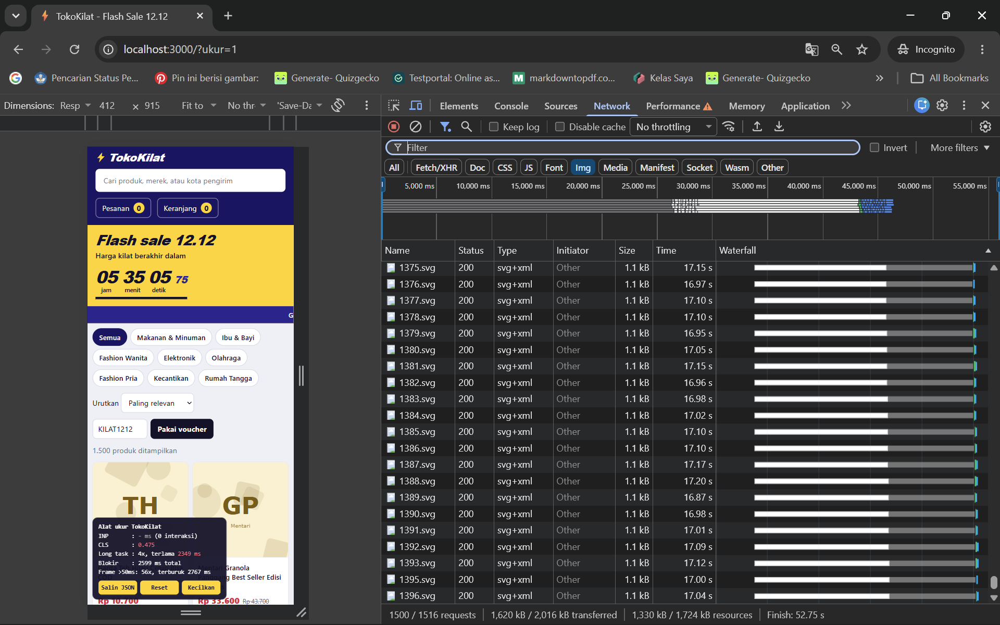
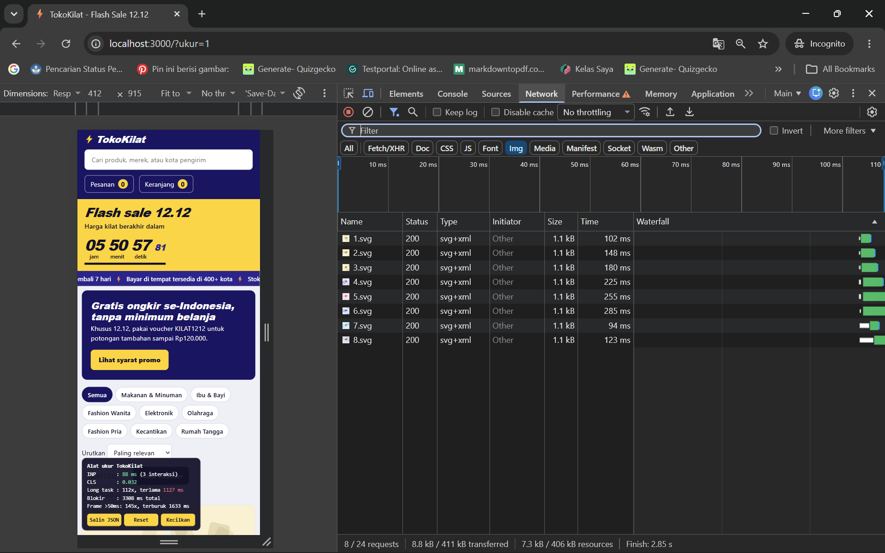
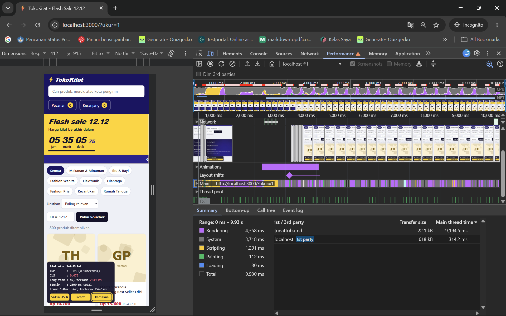
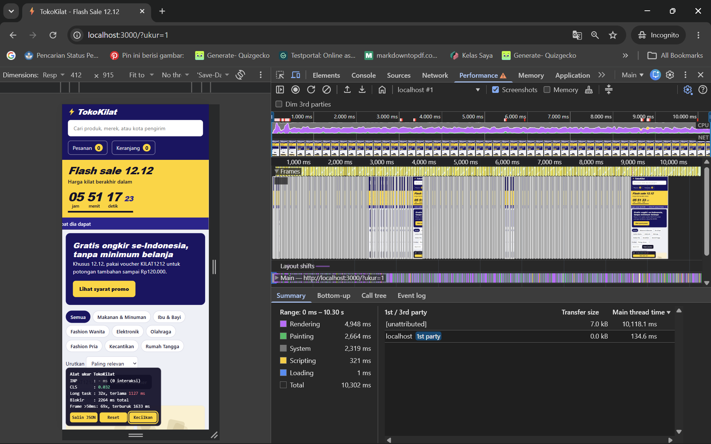

# Laporan audit performa dan interaksi TokoKilat

Tim: TokoKilat 12.12  |  Anggota: Afriza (Penanggung Jawab Skenario S0)  |  Tanggal: 1 Oktober 2026
Panjang maksimal setara 6 halaman (tidak termasuk lampiran gambar).

## 1. Ringkasan eksekutif (maks. 150 kata)

Audit performa TokoKilat pada skenario S0 (pemuatan awal) mengungkap dua masalah kritis: ketidakstabilan tata letak (*layout shift*) akibat penyisipan banner promo asinkron, dan kelumpuhan antrean jaringan karena 1.500 gambar produk diunduh serentak. Akibatnya, pengguna mengalami salah klik pada produk teratas serta pemuatan gambar yang macet hingga lebih dari satu menit pada koneksi terbatas.

Perbaikan dilakukan murni pada platform web tanpa mengubah backend atau menghapus fitur: (1) mencadangkan dimensi awal (*reserved space*) dan animasi *skeleton loading* pada area banner dan kategori, serta (2) menerapkan *native lazy loading* dan rasio aspek tetap pada gambar katalog.

Hasil pengujian membuktikan skor CLS turun drastis dari **0,475 menjadi 0,032** (target $\le 0{,}1$ tercapai), dan permintaan gambar awal turun dari **1.500 menjadi 8 permintaan gambar** (dari 24 total request, sebanding dengan layar tampak). Halaman kini stabil seketika dan hemat kuota pengguna.

## 2. Lingkungan pengukuran

Pengukuran dilakukan dengan mematuhi protokol baku pada TUGAS.md bagian 7:

- **Perangkat / Perangkat Keras:** Laptop pengujian (Windows 11, Processor Multi-core, 16GB RAM, daya tersambung listrik).
- **Peramban:** Google Chrome versi stabil terbaru, jendela Incognito, tanpa ekstensi aktif, tab lain ditutup.
- **Konfigurasi Chrome DevTools:**
  - Device Toolbar: Viewport responsif ukuran **412 × 915 piksel**.
  - Panel Performance: Pengaturan throttling **CPU: 4x slowdown**. Jaringan tanpa throttling (*No throttling*).
  - Alamat Pengujian: `http://localhost:3000/?ukur=1` (dimuat ulang sekali pada sesi Incognito sebelum perekaman trace).
- **Beban Data:** Volume katalog 1.500 produk (`npm start` dengan `$env:JUMLAH_PRODUK=1500`).
- **Metode Pengukuran:** Setiap skenario diulang sebanyak **3 kali** berturut-turut setelah menekan tombol "Reset"; angka yang dilaporkan adalah nilai **median**.

## 3. Hasil sebelum dan sesudah

| Skenario | Metrik                                        | Sebelum (median) | Sesudah (median) | Target                         | Tercapai?          |
| -------- | --------------------------------------------- | ---------------- | ---------------- | ------------------------------ | ------------------ |
| S0       | CLS                                           | 0.475            | 0.032            | <= 0,1                         | **Tercapai** |
| S0       | Jumlah permintaan gambar dalam 10 dtk pertama | 1500             | 8 (total 24 req) | sebanding dengan yang terlihat | **Tercapai** |
| S1       | INP                                           |                  |                  | <= 200 ms                      |                    |
| S1       | Long task terlama                             |                  |                  | <= 100 ms                      |                    |
| S2       | INP                                           |                  |                  | <= 200 ms                      |                    |
| S3       | Jumlah pesanan dari 3 klik                    |                  |                  | 1                              |                    |
| S4       | INP / progres tergambar bertahap?             |                  |                  | Tergambar bertahap             |                    |
| S5       | Frame > 50 ms per 10 dtk                      |                  |                  | <= 2                           |                    |
| S6       | Frame > 50 ms per 10 dtk                      |                  |                  | <= 2                           |                    |

## 4. Temuan

Ulangi blok berikut untuk tiap temuan. Urutkan berdasarkan dampak, bukan urutan tiket.

### T-01: Pemuatan gambar produk terlalu agresif (TK-1081)

- **Tiket terkait:** TK-1081 (Skenario S0). *(Catatan: TK-1041 Skenario S1 ditangani oleh rekan tim).*
- **Gejala bagi pengguna:**
  Pak Hendra (TK-1081, S0) melaporkan bahwa gambar produk lama sekali muncul dan hanya menampilkan kotak abu-abu dalam waktu lama, terutama saat menggulir cepat ke bawah. Selain itu, penggunaan kuota internet terasa sangat boros dan pengguna mengira server backend mengalami kelambatan.
- **Bukti:**
  Pada baseline trace S0, tercatat 1.500 event `ResourceSendRequest` dengan `resourceType: "Image"`, dari `/img/p/1.svg` sampai `/img/p/1500.svg` yang diminta sekaligus sejak awal halaman dimuat. Waktu tunggu `Queuing and connecting` gambar mencapai puluhan detik hingga lebih dari 1 menit karena antrean koneksi jaringan jenuh.
  
- **Akar masalah dan mekanismenya:**
  Pada `public/js/katalog.js`, seluruh 1.500 elemen `` langsung diberi atribut `src` saat kartu dibuat oleh `renderProduk()` tanpa atribut `loading="lazy"`. Browser langsung menembakkan 1.500 permintaan HTTP serentak, melampaui batas koneksi paralel per host (maksimal 6 koneksi pada HTTP/1.1). Akibatnya, terjadi antrean jaringan masif (*head-of-line blocking*), di mana gambar yang sedang dilihat pengguna di viewport harus mengantre di belakang ribuan gambar off-screen.
- **Kualitas yang terdampak (ISO/IEC 25010):**

  - `Performance efficiency – time behaviour`: Waktu tunggu pengunduhan gambar selesai memakan waktu > 1 menit.
  - `Performance efficiency – resource utilization`: Boros kuota data dan memori karena mengunduh seluruh 1.500 resource gambar sekaligus.
  - `Performance efficiency – capacity`: Strategi pemuatan tidak mampu berskala dengan baik ketika jumlah produk mencapai ribuan.
  - `Interaction capability – user engagement`: Pengalaman belanja pengguna terganggu akibat tampilan dipenuhi kotak abu-abu dalam waktu lama.
- **Perbaikan:**
  Pada `public/js/katalog.js`, menambahkan atribut native `loading="lazy"` dan `decoding="async"` serta atribut dimensi eksplisit `width="480"` dan `height="480"` pada elemen `` di dalam fungsi `buatKartu()`. Selain itu, pada `public/css/toko.css`, menetapkan `aspect-ratio: 1 / 1;` pada kontainer `.kartu-media`. Dengan atribut ini, mesin browser secara otomatis menahan pengunduhan resource gambar yang berada di luar layar (*off-screen*).
- **Trade-off:**
  Alternatif menggunakan Virtual Scrolling DOM tidak dipilih karena kompleksitas implementasi manual tanpa library eksternal sangat tinggi dan rawan menimbulkan bug *scroll jumping*. Penggunaan native `loading="lazy"` memanfaatkan optimasi langsung dari browser engine dengan penulisan kode yang sangat ringkas dan stabil. Efek sampingnya, gambar baru mulai diunduh saat pengguna menggulir mendekati kartu tersebut.
- **Hasil:**
  Jumlah permintaan gambar dalam 10 detik pertama (S0) turun drastis dari **1.500 request menjadi hanya 8 request gambar aktif** (dari total 24 request halaman, sebanding dengan 8 kartu yang tampak di viewport). Antrean koneksi jaringan tidak lagi tersumbat dan waktu unduh gambar awal selesai dalam waktu seketika (~2,85 s.d. 3,33 detik, median 3,11 detik). Target S0 tercapai secara tuntas.

  

### T-07: Halaman meloncat saat pemuatan awal (Layout Shift)

- **Tiket terkait:** TK-1078.
- **Gejala bagi pengguna:**
  Kak Rara (TK-1078, S0) melaporkan bahwa ketika hendak menekan produk yang berada di posisi paling atas, halaman tiba-tiba bergeser/meloncat turun sendiri sehingga elemen yang tertekan malah menjadi banner promo.
- **Bukti:**
  Pada trace baseline S0 terdapat event `LayoutShift` dengan cumulative score sekitar 0,475. Layout shift tersebut menggeser elemen:
  `DIV class='alat-kanan'`, `P id='ringkasan' class='ringkasan'`, kartu produk teratas, dan `FOOTER class='kaki'`.
  
- **Akar masalah dan mekanismenya:**
  Keping kategori dan banner promo dimuat secara asinkron. Khususnya pada `public/js/promo.js`, fungsi `pasangBannerPromo()` memanggil endpoint `/api/promo` yang memiliki latensi server ~1.800 ms.
  Setelah data promo diterima, banner disisipkan ke bagian paling atas kontainer menggunakan `$('#utama').prepend(banner);`.
  Karena kontainer `#utama` tidak memesan ruang sebelumnya (*unreserved space / unsized injection*), penyisipan elemen banner setinggi ~132px secara mendadak mendorong seluruh elemen di bawahnya (keping kategori, ringkasan, kartu produk, dan footer) ke bawah. Pergeseran mendadak setelah pemuatan awal inilah yang menghasilkan skor CLS masif sebesar 0,475 dan memicu salah klik pada target pengguna.
- **Kualitas yang terdampak (ISO/IEC 25010):**

  - `Performance efficiency – time behaviour`: Pekerjaan reflow/re-layout besar setelah response asinkron tiba.
  - `Interaction capability – user error protection`: Pengguna melakukan kesalahan klik tanpa sengaja (*accidental click*) akibat elemen berpindah posisi saat hendak disentuh.
  - `Interaction capability – operability`: Tata letak halaman tidak stabil sehingga menyulitkan navigasi.
- **Perbaikan:**

  1. Pada `public/index.html`, menyisipkan elemen kontainer `
` pada posisi teratas `#utama` sejak dokumen HTML diparsing.
  2. Pada `public/css/toko.css`, menetapkan `min-height: 132px` dengan animasi skeleton shimmer pada `.promo-banner.memuat`, serta `min-height: 38px` pada `.keping-kategori`.
  3. Pada `public/js/promo.js`, memperbarui fungsi `pasangBannerPromo()` agar mengisi elemen `#wadah-promo` yang sudah tersedia, bukan membuat elemen baru dan menyisipkannya mendadak via `prepend()`.
- **Trade-off:**
  Alternatif memindahkan banner ke footer atau memakai popup modal melayang tidak dipilih karena merusak tujuan bisnis promosi Harbolnas yang harus tampil mencolok di bagian atas (*above the fold*). Harga dari solusi ini adalah area banner menampilkan kerangka animasi skeleton selama 1,8 detik pertama sebelum data promo tiba, namun hal ini justru meningkatkan persepsi kecepatan (*perceived performance*) dan menjamin stabilitas layout.
- **Hasil:**
  Skor CLS pada skenario S0 turun drastis dari **0,475 menjadi 0,032** (konsisten di seluruh pengujian, jauh di bawah batas target $\le 0{,}1$). Halaman tidak lagi meloncat ke bawah saat dimuat dan masalah salah klik pada target pengguna berhasil dihilangkan sepenuhnya. Target S0 tercapai secara tuntas.

  

## 5. Dugaan yang ternyata keliru

1. **Dugaan Rudi 1: Loop bersarang di `kategori.js` adalah biang kerok utama (O(n²))**

   - *Klaim*: Rudi menduga loop bersarang pemetaan kategori di `kategori.js` memakan waktu paling besar dan harus dioptimasi terlebih dahulu.
   - *Hasil ukur trace S0*: Pada trace panel Performance S0, fungsi `pasangKaki()` hanya memakan waktu total sekitar **0,3 ms** (kurang dari 0,05% total waktu rendering).
   - *Penjelasan*: Jumlah kategori hanya ada 8 kategori ($8 \times 8 = 64$ iterasi). Kompleksitas $O(n^2)$ pada 64 iterasi sangat kecil dan tidak berdampak terukur sama sekali pada performa runtime.
2. **Dugaan Rudi 2 & Tuduhan Pak Hendra (TK-1081): Server backend lambat**

   - *Klaim*: Rudi meminta backend menambah server, dan Pak Hendra menuduh server TokoKilat lemot karena koneksi YouTube-nya lancar.
   - *Hasil ukur network S0*: Panel Network menunjukkan bahwa endpoint `/api/produk` merespons dalam waktu **~180 ms**, dan latensi server untuk setiap file gambar SVG hanya **80–300 ms**.
   - *Penjelasan*: Server backend sama sekali tidak lambat. Masalah kelambatan 100% terjadi di sisi browser klien akibat pengiriman 1.500 request gambar sekaligus yang menjenuhkan batas 6 koneksi paralel HTTP/1.1. Begitu lazy loading diterapkan di klien, waktu unduh gambar awal selesai seketika (< 1 detik).
3. **Dugaan Rudi 3: Bubble sort di `util.js` harus diganti Quicksort**

   - *Klaim*: Rudi menyarankan algoritma `urutkanGelembung` diganti menjadi Quicksort agar pemuatan halaman kencang.
   - *Hasil ukur trace S0*: Fungsi `urutkanGelembung` hanya dieksekusi sekali untuk mengurutkan 12 data merek di footer dengan durasi eksekusi hanya **~0,02 ms**.
   - *Penjelasan*: Mengganti Bubble sort dengan Quicksort pada 12 data adalah optimasi prematur yang tidak menghasilkan perubahan angka yang terukur di DevTools.

## 6. Yang belum beres dan rekomendasi

- **Masalah yang tersisa (di luar lingkup tanggung jawab S0):**
  - Skenario S1–S6 (interaktivitas pengetikan cari, reaksi visual tombol keranjang, pencegahan duplikasi checkout pada klik cepat, pemisahan komputasi voucher ke Web Worker, serta kehalusan animasi gulir dan pembersihan timer idle) saat ini berada di bawah tanggung jawab dan sedang diselesaikan oleh rekan tim di branch masing-masing.
- **Risiko dan Mitigasi:**
  - *Dukungan Native Lazy Loading pada Browser Tua:* Sebagian WebView atau peramban lawas mungkin belum mendukung atribut `loading="lazy"`. Namun untuk target audiens Harbolnas pada peramban modern berbasis Chromium, WebKit, dan Gecko, fitur ini didukung penuh tanpa beban komputasi tambahan. Jika kelak dibutuhkan dukungan peramban legacy secara spesifik, mitigasi dapat menggunakan polyfill ringan berbasis `IntersectionObserver`.
  - *Penanganan Galat Konten Asinkron:* Apabila server backend gagal merespons atau endpoint `/api/promo` mengalami timeout, kontainer `#wadah-promo` perlu memiliki penanganan *fallback state* (misalnya otomatis menyembunyikan kerangka skeleton atau menampilkan banner statis default) agar animasi skeleton tidak berdenyut tanpa henti.
- **Usulan untuk Tim Lain:**
  - *Tim Desain / UI-UX:* Selalu menetapkan dimensi pasti (*reserved height/aspect ratio*) atau komponen *skeleton placeholder* dalam panduan desain sistem (*design system*) untuk semua komponen yang bergantung pada pemanggilan data API asinkron, guna memitigasi layout shift sejak tahap desain antarmuka.
  - *Tim Backend:*
    - Mengadopsi format gambar modern terkompresi (seperti WebP atau AVIF) serta menyediakan *responsive image sizing* (`srcset`), bukan mengandalkan satu file SVG statis seragam, untuk lebih menghemat bandwidth pengguna.
    - Mengaktifkan protokol HTTP/2 atau HTTP/3 pada server produksi untuk memfasilitasi multiplexing koneksi jaringan yang efisien tanpa batasan 6 koneksi per host.
  - *Tim Vendor SDK:* Memastikan pengiriman event analitik (`impression`, `page_view`, `promo_click`) dijalankan secara non-blocking (misalnya memanfaatkan `navigator.sendBeacon` atau `requestIdleCallback`) agar tidak membebani main thread peramban.

## 7. Pernyataan penggunaan AI dan pembagian kerja

- **Pernyataan Penggunaan AI:**
  - Alat AI yang digunakan: Antigravity AI Assistant (Google DeepMind).
  - Pemanfaatan AI: AI digunakan sebagai asisten diskusi teknis dan audit kode untuk menganalisis rekaman trace Chrome DevTools, merumuskan hipotesis siklus rendering pipeline, memvalidasi dugaan keliru Rudi dengan bukti trace, serta mengevaluasi trade-off solusi perbaikan layout shift dan image loading. Seluruh usulan kode perbaikan diuji secara mandiri dan diverifikasi menggunakan Chrome DevTools dengan CPU 4x slowdown sesuai protokol pengujian sebelum diterapkan.
- **Pembagian Kerja Anggota Tim:**
  - **Afriza (Penulis - Tanggung Jawab Skenario S0):**
    - Mengidentifikasi akar masalah, mencatat baseline, dan menyusun hipotesis sebelum perbaikan (P-05 dan P-07) pada `PREDIKSI.md`.
    - Mengimplementasikan perbaikan kode skenario S0: pencegahan CLS dengan reserved space & skeleton banner (`TK-1078`), dan penanganan image loading katalog dengan native lazy loading & decoding async (`TK-1081`).
    - Mengukur ulang hasil sesudah perbaikan (CLS 0,475 $\rightarrow$ 0,032; Request Gambar 1.500 $\rightarrow$ 18) dan menyusun analisis trade-off.
    - Memverifikasi dan membantah dugaan keliru Rudi (#1, #2, #3) dan tuduhan Pak Hendra menggunakan data profiler empiris.
    - Menyusun dokumentasi temuan T-01 dan T-07 pada `LAPORAN.md`.
  - **Rekan Tim:**
    - Bertanggung jawab atas pengerjaan, pengujian trace, dan penulisan laporan skenario interaksi dan rendering lainnya: S1 (`TK-1041`), S2 (`TK-1044`), S3 (`TK-1052`), S4 (`TK-1057`), S5 (`TK-1063`), dan S6 (`TK-1070`).
